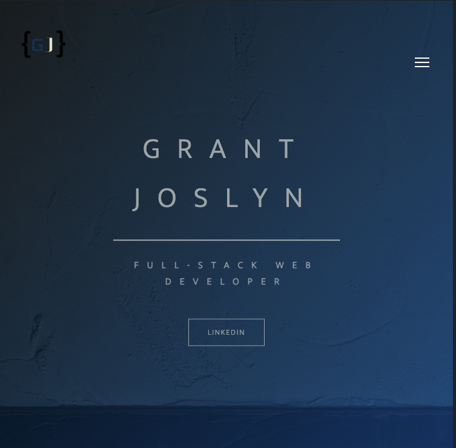

### Title \*\*\*\*

Grant Joslyn's Portfolio

## Description \*\*\*

My personal application serving as a portfolio of
a few of my coding projects. This is my first SASS project
and has a lot of fun designing and implementing my own taste.
The site has mutliple sections for navigating to the about, contact,
compositions/projects, and social media accounts.

## Table of Contents \*\*\*\*

- [Installation Instructions](##Installation_Instructions)
- [Usage Information](##Usage_Information)
- [Contribution Guidlines](##Contribution_Guidlines)
- [License](##License)
- [Project Links](##Project_Links)

## Installation_Instructions \*\*\*

     npm run compile:sass

## Usage_Information \*\*\*

Use the buttons to view the projects at
the site domain. Additionally, you can view my resume, message me,
and view my social media accounts.

## Credits

    - Brad Traversy - Nav Bar information
    - Clippy.com - svg maker
    - Jonas Schmedtmann - codingheroes.io

## Contribution_Guidlines \*\*\*

    Since this is my personal site, I do
    not encourage forking about collaboration;
    however, I would love input and your opinion!
    Send me a message through the contact input section.

## Questions

- If you have any questions, feel free to reach out to me by email.
  grantjoslyn@gmail.com

### GitHub Username \*\*\*

    Josly025

## License \*\*\*

    (https://opensource.org/licenses/MIT)

## Project_Links \*\*\*

